# FmlxDeviceUtils Submodules
Repository that contains Python-based tool to communicate with Formulatrix devices via FMLX Protocol. Using this tool, user will be able to send commands and responding to events sent by Formulatrix devices. The tool uses our Formulatrix.Core libraries that relies on .NET runtime.

# Table of Contents

- [Dependencies](#dependencies)
- [Usage Guide - TLDR](#usage-guide-tldr)
- [Usage Guide](#usage-guide)
    - [Setup](#setup)
    - [Using Enumerations](#using-the-enumerations)
    - [Sending Device Command](#sending-device-command)
    - [Handling Device Event](#handling-device-event)
    - [Utility Function List](#utility-function-list)
- [Creating Opfunction List File](#creating-opfunction-list-file)
    - [Opfunction List Format](#opfunction-list-format)
    - [Supported Data Types](#supported-data-types)
    - [Syntax Rules](#syntax-rules)
- [Convert PyDictionary Opfunction List to YAML Format](#convert-pydictionary-opfunction-list-to-yaml-format)

# Dependencies

Known to work on:

- Windows, using:
    - Python 2.7.14 - **32-bit** (needed by Kvaser CAN driver)
    - Python 3.8.5 - **32-bit**
    - .NET 4.5
    - Pythonnet 2.3.0 (install using setup.py)
    - PyYaml 3.12 (install using setup.py)
- Linux/Raspi, using:
    - Python 2.7.9
    - Mono 5.4.1.6
    - Pythonnet 2.3.0 (due to pythonnet 2.3.0 installation bug, please copy Raspi image with pythonnet from SE department if you don't have pythonnet yet)
    - PyYaml 3.12 (install using setup.py)

# Cloning Submodule Guide
To clone this repo as part of your main projects submodules, Note We are using sourcetree

1. Make your own script folder 
    
    <br/>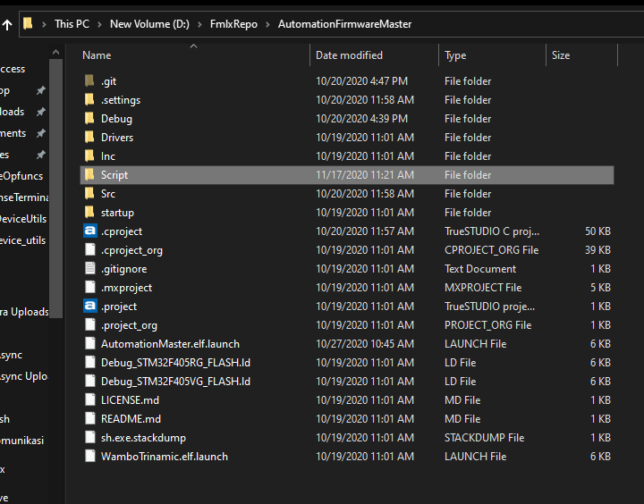
    <br/>

1. Open Your Repo on the sourcetree and right click below sthases and choose add submodule

    
    <br/>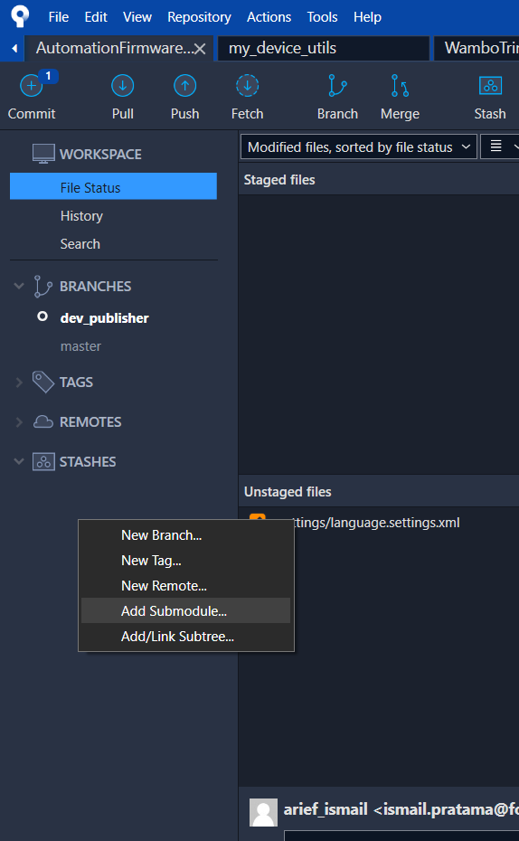
    <br/>

1. Fill the Source Path / URL by using this git link and the relative path to {YOUR_SCRIPT_FOLDER/FmlxDeviceUtils} then click Ok
    
    <br/>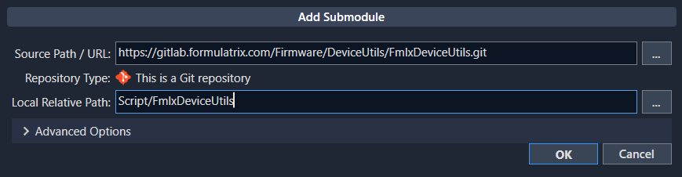
    <br/>    

1. The submodules has been cloned to your folder, then make folder named DeviceOpfuncs and put your device specifics API there

    <br/>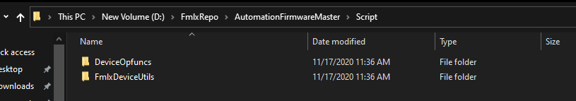
    <br/>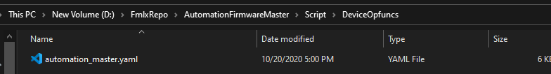
    <br/>

1. Put your python script outside just like this

    <br/>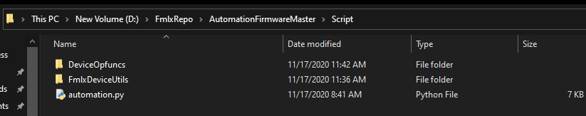
    <br/>

1. To Correctly edit your script see the next section [Basic Python Usage Guide](#Basic-Python-Usage-Guide)

1. Commit the untracked files by choosing Untracked files, the click stage all ( a lot of people forget this when they add new files to their Repo, so BEWARE ) :

    <br/>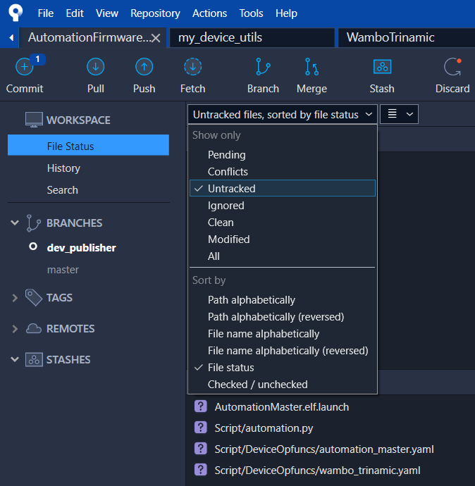
    <br/>

1. Choose Modified files again, insert your commit message then click commit and push

1. The Submodule menu will appear

    <br/>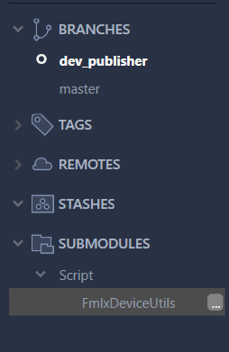
    <br/>

# Basic Python Usage Guide

1. Use This header as your python script initialization

    ```python
    ''' basic fmlx script header '''
    ''' don't delete it! '''
    import sys
    import os
    abs_path = os.getcwd()
    lib_path = abs_path + '/FmlxDeviceUtils/FmlxDeviceUtils'
    sys.path.append(lib_path)
    from FmlxDevice import FmlxDevice,FmlxDevicePublisher
    from Formulatrix.Core.Protocol import FmlxController
    import FmlxDeviceConnector
    ```

1. Insert your additional module that you want to use on your script

    ```python
    ''' insert your additional header/ module here '''
    from fopleyMotor import CFopleyMotor
    import fopleyUtilities as fu 
    from FmlxWireshark import CDataConstructor
    from FmlxWireshark import CFmlxPacketSniffer
    from FmlxWireshark import CYamlParser
    import time
    import yaml
    from functools import partial
    ```

1. Insert your yaml path files using this format 

    ```python
    ''' your yaml path '''
    path= abs_path+"/DeviceOpfuncs/wambo_trinamic.yaml"
    ```

1. Write your device address, use list ( [] ) or it will not works on FmlxDeviceConnector

    ```python
    """  # 0 basic usage of FmlxDeviceConnector module """
    ''' define your address'''
    address=[15]
    ```
    

1. Make the driver instance using FmlxDeviceConnector.FmlxDeviceConnector()
    
    ```python
    # it will return two values, the driver instance drv[0] and our address drv[1]
    drv=FmlxDeviceConnector.FmlxDeviceConnector(address_list=address)
    ```

1. Now we can pass the drv values to use the FmlxDevice

    ```python
    m = FmlxDevice(drv[0], address[0], path)
    # connect it, then it is ready to use.
    m.connect()
    ```

1. The full python header will look like this:

    ```python
    ''' basic fmlx script header '''
    ''' don't delete it! '''
    import sys
    import os
    abs_path = os.getcwd()
    lib_path = abs_path + '/FmlxDeviceUtils/FmlxDeviceUtils'
    sys.path.append(lib_path)
    from FmlxDevice import FmlxDevice,FmlxDevicePublisher
    from Formulatrix.Core.Protocol import FmlxController
    import FmlxDeviceConnector


    ''' insert your additional header/ module here '''
    from fopleyMotor import CFopleyMotor
    import fopleyUtilities as fu 
    from FmlxWireshark import CDataConstructor
    from FmlxWireshark import CFmlxPacketSniffer
    from FmlxWireshark import CYamlParser
    import time
    import yaml
    from functools import partial

    ''' your yaml path '''
    path_automation= abs_path+"/DeviceOpfuncs/automation_master.yaml"

    """  # 0 basic usage of FmlxDeviceConnector module """
    ''' define your address'''
    address=[44]

    # it will return two values, the driver instance drv[0] and our address drv[1]
    drv=FmlxDeviceConnector.FmlxDeviceConnector(address_list=address)

    # insert the return value into FmlxDevice,
    # and put your yaml file at the end of the argument
    m = FmlxDevice(drv[0], address[0], path_automation)
    m.connect()
    ```

1. To run it on your script folder script, click address bar and type 'cmd' and enter

    <br/>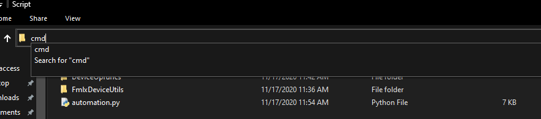
    <br/>

1. Run your script by typing python -i {YOUR_SCRIPT_NAME.py} note -i is python interactive mdode so our program will not immidiately exit
    <br/>
    ```console
    python -i automation.py
    ``` 
    <br/>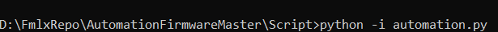
    <br/>

1. Next the FmlxDeviceConnector menu will show, we need to choose our connected drivers. In my case, i was using KVaser so i choose no.2

    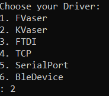
    <br/>

1. To test it use the general Opcode Function Name, for example i was calling get_app_name
    <br/>
    ```console
    m.get_app_name()
    ``` 
    result :
    <br/>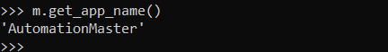
    <br/>

1. That's the basic, the next guide will show you advance feature of FmlxDevice submodule and how to use it.


### Using the Enumerations

Let's say you have following enumeration in YAML opfunction list file:

```yaml
ENUMS:
- MotorError:
  - desc : Various states/causes of motor error
  - type : Uint16
  - value:
    - errNone    : [0, No error has occured]
    - errEncoder : [1, Error caused by encoder failure]
```

and you create an FmlxDevice object based on this YAML file called **fdevice**. You can access the enumeration values by typing:

```python
fdevice.MotorError.errNone
fdevice.MotorError.errEncoder
```

If you want to view the description of the enumeration, type:
```python
fdevice.MotorError.description()
```
It will print the enumeration description, enumeration member list, and enumeration member description.

### Sending Device Command

Sending command to device can be done by simply invoking each command function as if they are public functions of FmlxDevice object. Following example shows how to use two general device commands, getting device application name and firmware version:

```python
fdevice.get_app_name()
fdevice.get_version()
```

Following line shows how to send command with arguments. It will set upper and lower temperature limit of a chamber temperature controller.

```python
fdevice.set_limit_celcius(8.7, 55.5)
```

If you want to view the description of a command, simply append **description()** to the command function name:
```python
fdevice.set_limit_celcius.description()
```

### Handling Device Event

The FmlxDevice class has a device event listener. It automatically runs in the background when you connect to a device. This event listener will respond to any event packet sent by formulatrix devices. However, you need to create your own event handlers to process the event. The event handlers can be hooked to the event listener. Event listener will fire the correlated handler every time an event is sent by device. There are two ways to hook an event handler, which are:

1. **General event hooking**

    You can hook an event handler such that for any event generated by device, the handler will be fired. This can be done by hook the handler to FmlxDevice object member named **OnEvent**. Upon detecting any event packet, event listener will put the packet as a function argument to the handler, then fire the handler. Therefore, you need to make sure the event handler has one function argument, otherwise it will not be fired.

    Hooking and hook removal is simply done using addition and subtraction. Following example shows how to make general event handler that will print packet opcode.

    ```python
    def print_event_opcode(packet):
        print packet.Opcode

    #hooking the event handler
    fdevice.OnEvent += print_event_opcode

    #this will remove the event handler hook
    fdevice.OnEvent -= print_event_opcode
    ```

    The details of event packet class can be obtained in Formulatrix.Core repository.

2. **Event-specific hooking**

    You can also choose to hook an event handler to a specific event. Similar to general event hooking, the mechanism is provided via addition and subtraction. However, instead of hooking to OnEvent, you need to hook to the specific event member of FmlxDevice object. Let's say that you have two device events, which are:

    ```yaml
    - event_1:
      - op : 78
      - ret: null

    - event_2:
      - op : 79
      - ret: [appname : String, status : Int32]
    ```

    Field *op* is opcode and *ret* is list of data generated by the event. FmlxDevice will generate two event members:

    ```python
    fdevice.event_1
    fdevice.event_2
    ```

    FmlxDevice event listener will listen to these two events. Upon detecting them, it will extract data from the packet and convert it into python OrderedDict. Based on these two event definition, the produced data are:

    ```python
    #data from event_1 (empty):
    {[]}

    #data from event_2:
    {'appname' : 'helloapp', 'status' : 1}
    ```
    Therefore, you need to make event handler that can accept the dictionary argument, either by using **\*\*kwargs argument** or specifying the **exact keyword arguments**. Handlers with improper argument will be ignored automatically. Following example illustrates the proper usage of event specific hooking:

    ```python
    def handler_1(**kwargs):
        print 'Hello World'

    #argument name should be exactly as same as event data keywords
    #all of event data keywords should be put in argument list
    def handler_2_kword(appname, status):
        print appname
        print status

    #functionally same as handler_2_kword
    def handler_2(**kwargs):
        print kwargs['appname']
        print kwargs['status']

    #hook the handlers
    fdevice.event_1 += handler_1
    fdevice.event_2 += handler_2
    fdevice.event_2 += handler_2_kword

    #remove all of handler hooks
    fdevice.event_1 -= handler_1
    fdevice.event_2 -= handler_2
    fdevice.event_2 -= handler_2_kword
    ```

Similar with commands and enums, you can access the description of an event by appending **description()** to the event name, such as:
```python
fdevice.event_1.description()
fdevice.event_2.description()
fdevice.event_3.description()
```

### Utility Function List

List of FmlxDevice public utility functions:

```python
fdevice.connect() #connecting to device
fdevice.disconnect() #disconnect from device 
fdevice.is_connected() #check if connection to device has been established
fdevice.set_log_handler() #set logging handler/output
fdevice.list_commands() #list commands supported by device
fdevice.list_events() #list events generated by device
fdevice.list_enums() #list enums supported by device
```

Please use help(function) for more detailed function description, for example:

```python
help(fdevice.set_log_handler)
```

# Creating Opfunction List File

### Opfunction List Format

Opfunction list is written in YAML file based on following format:

```yaml
APPNAME : device_app_name
VERSION : device_firmware_version

ENUMS:
- Enum1:
  - desc : Enum Description is written here
  - type : Uint16
  - value:
    - enumItem1 : [value, Enum Item 1 Description (can be filled with '' if empty)]
    - enumItem2 : [value, Enum Item 2 Description (can be filled with '' if empty)]

COMMANDS:
- command1_name:
  - op  : command1_opcode
  - arg : null
  - ret : null
  - desc: |
      Command Description is written here as an indented block (minimum of 2 spaces
      from desc keyword indentation). Command description should be written after
      vertical bar sign (|), which is YAML standard to say that the next indented 
      block should be treated as a whole string.

- command2_name:
  - op  : command2_opcode
  - arg : [arg1_name : arg1_type, arg2_name : arg2_type, ..., argn_name : argn_type]
  - ret : [ret1_name : ret1_type, ret2_name : ret2_type, ..., retn_name : retn_type]
  - desc: |
          Four spaces indented block is also okay.

EVENTS:
- event1_name:
  - op  : event1_opcode
  - ret : null
  - desc: A short description can be written inline, without vertical bar (|).

- event2_name:
  - op  : event1
  - ret : [ret1_name : ret1_type, ret2_name : ret2_type, ..., retn_name : retn_type]
  - desc: |
          Pretend you're water. Just floating without any effort. Having a good day.
          All you have to learn here is how to have fun. Remember how free clouds are.
          They just lay around in the sky all day long. Talent is a pursued interest.
          That is to say, anything you practice you can do. - Bob Ross
```

Example of an YAML opfunction list:

```yaml
APPNAME : Nighthawk
VERSION : 2.2.1 DEV2

ENUMS:
- MotorError:
  - desc : Various states/causes of motor error
  - type : Uint16
  - value:
    - errNone    : [0, No error has occured]
    - errEncoder : [1, Error caused by encoder failure]

- MotorState:
  - desc : Motor Status
  - type : Uint16
  - value:
    - motorOff: [0, '']
    - motorOn : [1, '']

COMMANDS:
- save_configuration:
  - op  : 3
  - arg : null
  - ret : null
  - desc: Save device configuration to EEPROM

- get_motor_limits:
  - op  : 10
  - arg : [motor_id: Int16]
  - ret : [min_limit: Double, max_limit: Double]
  - desc: |
          Obtain motor limits. Args:
          - motor_id : the identified number of motor
          Returns:
          - min_limi : motor minimum limit
          - max_limit: motor maximum limit

EVENTS:
- motor_error:
  - op  : 900
  - ret : [errcode : MotorError]
  - desc: |
           Fire if motor error has occured.

- batt_low_alarm:
  - op  : 901
  - ret : [status_flags: UInt16, batt_volt: Double]
  - desc: |
          Fire if battery is low, returns:
          - status_flags : status flag obviously
          - batt_volt : battery voltage
```

**NOTICE that defined Enum type can also be used for rets/args. In fact, if an argument or return is supposed to be an enumeration, you SHOULD state the data type as the Enum, for clarity.**

### Supported Data Types

- Single data types:
 
    - **Boolean**
    - **UInt16**
    - **UInt32**
    - **Int16**
    - **Int32**
    - **Double**
    - **String**

- Array data types **WITHOUT** specified length:

    - **Array_UInt16**
    - **Array_Int16**
    - **Array_UInt32**
    - **Array_Int32**
    - **Array_Double**

- Array data types **WITH** specified length:

    - **Array_UInt16_c**
    - **Array_Int16_c**
    - **Array_UInt32_c**
    - **Array_Int32_c**
    - **Array_Double_c**

- **Any defined Enum in YAML**, as long as it is based on supported types (specified in 'type' field) mentioned above.

There are special rules for *arg* or *ret* member with array data type, which are:

- Array without specified length should always be put at the end of *arg* or *ret* list.
- Array with specified length can be put anywhere in *arg* or *ret* list. However, device should always provide array length. Writer should put it exactly one index before the array *arg*/*ret* member in the list.

Example of how to write array type is shown below:

```yaml
#this is correct
- command_2:
  - op : 1
  - arg: [deviceid : Int16, array1_data : Array_UInt16]
  - ret: [array2_length : UInt16, array2_data : Array_UInt16_c, status : String]

#this is incorrect
- command_2:
  - op : 1
  - arg: [array1_data : Array_UInt16, deviceid : Int16] #array without length is not placed at the end of list
  - ret: [array2_data : Array_UInt16_c, status : String] #array with length, but there isn't any ret/arg to specify the length
```

### Syntax Rules

**General rule:**

The writing strictly follows YAML specification, with emphasis on:

- Indentation should be in space, tab cannot be used
- Indentation level should be consistent, similar to Python rule
- List/minus ('-' sign) and colon (':' sign) should always be followed by at least one space. Otherwise, it will be treated as part of a keyword or value.

**Enum, Command, and event related rules:**

- Enumerations should be put under **ENUMS** field
- Command opfunctions should be put under **COMMANDS** field
- Event opfunctions should be put under **EVENTS** field.
- Each of enums and opfunctions should be written as YAML list item (with '-' sign).
- Enumerations, commands, and events should follow the format explained above.
- Opcode should be specified (cannot be empty/null).

**Argument and return list related rules:**

- *arg* and *ret* value should be written as array of keyword-value pair ( [key : value, ...] ). The keyword field is the opfunction argument or return name, and value field is the data type.
- *arg* and *ret* without value should be filled with *null*

# Convert PyDictionary Opfunction List to YAML Format
There might be a chance that somehow your old opfunction list in Python dictionary form does not end up in DeviceOpfuncs folder and converted to YAML file yet. In this case, you can simply use the **convert()** function inside **Dict2Yaml.py** module. This module can be found inside FmlxDeviceUtils/FmlxDeviceUtils folder.

You only need to make a file that contains your old opfunction list in Python dictionary form. This file can only contain 1 set of command dictionary and/or 1 set of event dictionary. The command dictionary should have **'commands'** keyword in its name and the event dictionary should have **'events'** keyword in its name. For example:

```python
nighthawk_commands = [
    {
        'opcode': 3,
        'name': 'save_configuration',
        'arg_defs': [],
        'ret_defs': []
    },
    {
        'opcode': 10,
        'name': 'get_motor_limits',
        'arg_defs': ('motor_id', Int16),
        'ret_defs': [('min_limit', Double), ('max_limit', Double)]
    }
]

nighthawk_events = [
    {
        'opcode': 512,
        'name': 'motor_move_started',
        'evt_def': ('motor_id', Int16)
    },
    {
        'opcode': 513,
        'name': 'motor_move_done',
        'evt_def': [('motor_id', Int16), ('status', UInt16), ('position', Double)]
    }
]
```

Call the convert() function, and the function will convert the file automatically into YAML-formatted opfunction list file. Please use **help(convert)** or check the source code for further function usage information. It is also possible to batch convert files by specifying input path to folder instead of a file in convert() argument.